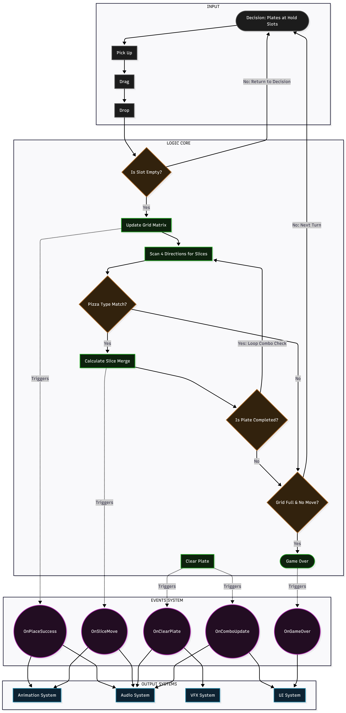

# 🍕 Pizza Crafter (Match-6 Puzzle)

Chào mừng bạn đến với **Pizza Crafter**! Đây là một tựa game giải đố (Puzzle) xoay quanh việc sắp xếp và ghép nối các miếng Pizza đa sắc màu. Dự án được thiết kế với chuẩn kiến trúc **Event-Driven (Observer Pattern)** kết hợp **FSM (Finite State Machine)** để đảm bảo hiệu suất cao và dễ dàng mở rộng.



---

## 🎮 1. Luồng Chạy Chính Của Game (Game Flow)

Game vận hành theo một cỗ máy trạng thái (FSM) nằm trong `GameStateManager.cs`. Mọi luồng xử lý đều tuân thủ nguyên tắc:
**UI KHÔNG GỌI TRỰC TIẾP LOGIC GAME** (Tất cả thông qua `GameEventManager.cs`).

### A. Khởi tạo (Booting)
1. `DataManager` đọc file save từ máy người chơi (Vàng, Level, Tiến trình nhiệm vụ, Các skin đã mua).
2. `GameEventManager` khởi động, sẵn sàng lắng nghe các sự kiện (Event Bus).
3. `GridManager` vẽ bàn cờ dựa trên cấu hình JSON.

### B. Vòng lặp Gameplay (Playing State)
1. **LobbyManager** sinh ra các đĩa Pizza với số lượng và màu sắc ngẫu nhiên.
2. **DragDropManager** (Bộ não của Game) cho phép người chơi kéo đĩa thả vào `GridCell` trên bàn cờ.
3. Khi đặt thành công:
   - Thuật toán `CheckNeighbors` quét 4 hướng xung quanh.
   - Các miếng Pizza cùng màu sẽ bay (bay mượt bằng DOTween) từ đĩa này sang đĩa khác theo quy tắc dồn nén.

### C. Nổ Combo & Tính Điểm (Checking State)
1. Sau khi dồn, `PizzaPlate` kiểm tra nếu nó đủ 6 miếng (Max Slices) CÙNG MỘT MÀU.
2. Nếu đủ -> Phát nổ (Bùm!). 
   - Gọi hàm `DataManager.Instance.AddGold()`.
   - Sinh ra hạt Particle System từ `ObjectPooler`.
   - Bắn Event cộng điểm và Exp.
3. Nếu bàn chơi hết ô trống -> Chuyển sang **GameOverState**.
4. Các hệ thống UI (như `GoldUIUpdater`, `AchievementItemUI`) sẽ tự động thay đổi khi nghe thấy Event từ `GameEventManager`, hoàn toàn không cần gọi `Update()` mỗi khung hình.

---

## ⚙️ 2. Hướng Dẫn Cấu Hình Dữ Liệu Bằng JSON

Dự án được thiết kế hướng dữ liệu (Data-Driven) giúp Game Designer có thể cân bằng game (Balance) mà không cần mở code C#. Tất cả file cấu hình nằm trong thư mục: `Assets/Resources/`.

### 2.1 Cấu Hình Bàn Cờ (`GridConfig.json`)
File này quyết định độ lớn của bàn cờ (Grid).
```json
{
  "rows": 5,        // Số hàng
  "columns": 5,     // Số cột
  "cellSize": 2.0,  // Kích thước của mỗi ô lưới
  "spacing": 0.2    // Khoảng cách giữa các ô
}
```
*Mẹo:* Bạn có thể tích vào ô `Use Inspector Config` trong script GridManager để test thử các kích thước khác nhau trực tiếp trên Editor trước khi chốt vào file JSON.

### 2.2 Cấu Hình Cửa Hàng Skin (`SkinDatabase.json`)
Mọi Skin của đĩa Pizza được khai báo ở đây. ShopUI sẽ tự động tải danh sách này lên.
```json
{
  "skins": [
    {
      "id": "SinglePlate3",                   // Mã ID duy nhất (Dùng để Save Game)
      "name": "Khay Nâu Cổ Điển",             // Tên hiển thị trong Shop
      "price": 250,                           // Giá mua bằng Vàng (Nhập 0 = Miễn phí)
      "prefabPath": "PlateSkins/SinglePlate3", // Đường dẫn chứa Prefab 3D
      "iconPath": "Icons/Plate3"              // Đường dẫn chứa ảnh 2D hiển thị trong Shop
    }
  ]
}
```
**Quy tắc thêm Skin mới:**
1. Kéo thả Prefab 3D của đĩa vào thư mục `Assets/Resources/PlateSkins/`.
2. Kéo ảnh 2D vào `Assets/Resources/Icons/`.
3. Bổ sung một đoạn mã JSON tương tự như trên vào cuối danh sách. Code sẽ tự động lo phần còn lại!

### 2.3 Cấu Hình Nhiệm Vụ (`QuestsData.json`)
*(Nếu có áp dụng)* Định nghĩa tên nhiệm vụ, số lượng cần đạt được, và phần thưởng tương ứng. Dữ liệu tiến độ được `DataManager` lưu thẳng vào thiết bị người dùng.

---

*Tài liệu được cập nhật cho Tuần 4 - Phục vụ giai đoạn Báo cáo và Nghiệm thu dự án.*
